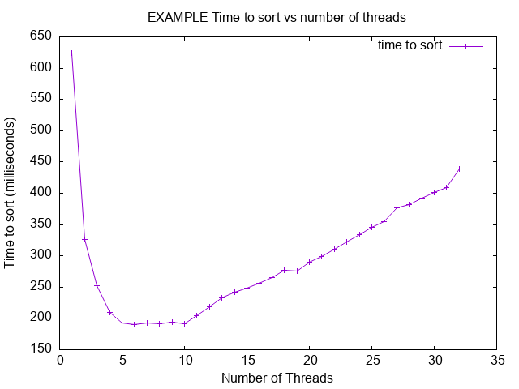

# Project 3

- Name: Jon Flores
- Email: jonathanflores@u.boisestate.edu
- Class: 452-001

## Known Bugs or Issues

None that I am aware of

## Experience

As I progress through this course, I am slowly but surely becoming more comfortable with the C programming language again. I was very excited to tackle this project after discussing it in class with Dr. Panter, so I had an architecture already in mind when sitting down to code. As such, I started by laying out a skeleton of what I had envisioned, then started to code it up by hand. Finally, I checked all the files through AI to check for validity in terms of syntax, made a few minor adjustments, and then repeated this process for compiler errors and warnings as they began to appear. Eventually I had a working code with minimal input from AI this time, which felt good. I had a little trouble ensuring that I used a lock in this assignment to meet the assignment criteria, as my approach did not necessarily require one, but I did get one in there.

## Analysis

- Were you able to generate soething close to what the example showed?
    - Yes, but on onyx, I had to greatly increase the size of the arrays to be sorted to generate something close to the example plot. The best results I saw were for 100000000 element arrays, but after some discussion with Dr. Panter, he confirmed that this was acceptable.

- Did you see a slowdown at some point? Why or why not?
    - Oddly enough, I did see some slow down on 2 threads, most likely due to some overhead introduced in my methodology, but everything after that followed a pretty smooth pattern of decreased run time, with a very slight upwards trend as the number of threads approached the number of cores available. I have adjusted the generateplot.sh script to go up to my max thread count to further demonstrate this trend on onxy.

- Did your program run faster and faster when you added more threads? Why or Why not?
    - My program did run faster and faster for a good while when adding more threads, but eventually it stabilized, then, as the number of threads approached the number of cores, there was a slight upward trend appearing again.

- What was the optimum number of threads for your machine?

- What was the slowest number of threads for your machine?

Here is an example of how to include a plot in your README:

