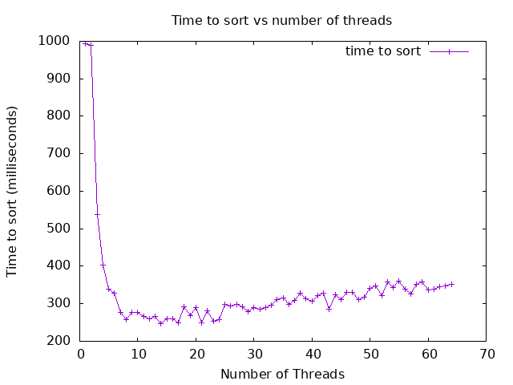

# Submission Report

- Submission generated at 10/24/2025 at 22:15:24

- Machine info: Linux runnervmwhb2z 6.11.0-1018-azure #18~24.04.1-Ubuntu SMP Sat Jun 28 04:46:03 UTC 2025 x86_64 x86_64 x86_64 GNU/Linux

## Note to Students

Please read this report carefully before submission.
Ensure that all sections are complete and accurate.
Look for any errors in the build or test outputs.
If you find any issues, correct them before submitting.
Post any questions on the class discussion board for help.


---

## README

# Project 3

- Name: Jon Flores
- Email: jonathanflores@u.boisestate.edu
- Class: 452-001

## Known Bugs or Issues

None that I am aware of

## Experience

As I progress through this course, I am slowly but surely becoming more comfortable with the C programming language again. I was very excited to tackle this project after discussing it in class with Dr. Panter, so I had an architecture already in mind when sitting down to code. As such, I started by laying out a skeleton of what I had envisioned, then started to code it up by hand. Finally, I checked all the files through AI to check for validity in terms of syntax, made a few minor adjustments, and then repeated this process for compiler errors and warnings as they began to appear. Eventually I had a working code with minimal input from AI this time, which felt good. I had a little trouble ensuring that I used a lock in this assignment to meet the assignment criteria, as my approach did not necessarily require one, but I did get one in there.

## Analysis

- Were you able to generate soething close to what the example showed?
    - Yes, but on onyx, I had to greatly increase the size of the arrays to be sorted to generate something close to the example plot. The best results I saw were for 10000000 element arrays, but after some discussion with Dr. Panter, he confirmed that this was acceptable.

- Did you see a slowdown at some point? Why or why not?
    - Oddly enough, I did see some slow down on 2 threads, most likely due to some overhead introduced in my methodology, but everything after that followed a pretty smooth pattern of decreased run time, with a very slight upwards trend as the number of threads approached the number of cores available. I have adjusted the generateplot.sh script to go up to my max thread count to further demonstrate this trend on onxy.

- Did your program run faster and faster when you added more threads? Why or Why not?
    - My program did run faster and faster for a good while when adding more threads, but eventually it stabilized, then, as the number of threads approached the number of cores, there was a slight upward trend appearing again.

- What was the optimum number of threads for your machine?
    - On Onyx, it seems like the optimal number of threads was 45.

- What was the slowest number of threads for your machine?
    - On Onyx, the slowest number of threads still seemed to be 2. This is most likely due to some overhead my method introduced.

Here is an example of how to include a plot in your README:


---


## Build Output

This section was generated by running `make all` in the project root directory.

```bash
make[1]: Entering directory '/home/runner/work/Fall2025CS452P3/Fall2025CS452P3'
mkdir -p build/debug
cc -g -O0 -DDEBUG -fno-omit-frame-pointer -fsanitize=address -c src/lab.c -o build/debug/lab.c.o
mkdir -p build/debug
cc -g -O0 -DDEBUG -fno-omit-frame-pointer -fsanitize=address -c src/main.c -o build/debug/main.c.o
cc -g -O0 -DDEBUG -fno-omit-frame-pointer -fsanitize=address build/debug/lab.c.o build/debug/main.c.o -o build/debug/myapp_d -fsanitize=address
make[1]: Leaving directory '/home/runner/work/Fall2025CS452P3/Fall2025CS452P3'
make[1]: Entering directory '/home/runner/work/Fall2025CS452P3/Fall2025CS452P3'
mkdir -p build/release
cc -Wall -Wextra -O2 -fPIE -MMD -MP -Wformat -Wformat=2 -Wconversion -Wsign-conversion -Wimplicit-fallthrough -fstack-protector-strong -Werror=format-security -Werror=implicit -Werror=incompatible-pointer-types -Werror=int-conversion -c src/lab.c -o build/release/lab.c.o
mkdir -p build/release
cc -Wall -Wextra -O2 -fPIE -MMD -MP -Wformat -Wformat=2 -Wconversion -Wsign-conversion -Wimplicit-fallthrough -fstack-protector-strong -Werror=format-security -Werror=implicit -Werror=incompatible-pointer-types -Werror=int-conversion -c src/main.c -o build/release/main.c.o
cc -Wall -Wextra -O2 -fPIE -MMD -MP -Wformat -Wformat=2 -Wconversion -Wsign-conversion -Wimplicit-fallthrough -fstack-protector-strong -Werror=format-security -Werror=implicit -Werror=incompatible-pointer-types -Werror=int-conversion build/release/lab.c.o build/release/main.c.o -o build/release/myapp 
make[1]: Leaving directory '/home/runner/work/Fall2025CS452P3/Fall2025CS452P3'
make[1]: Entering directory '/home/runner/work/Fall2025CS452P3/Fall2025CS452P3'
mkdir -p build/tests
cc -g -O0 -DTEST -fprofile-arcs -ftest-coverage -c src/lab.c -o build/tests/lab.c.o
mkdir -p build/tests
cc -g -O0 -DTEST -fprofile-arcs -ftest-coverage -c src/main.c -o build/tests/main.c.o
mkdir -p build/tests/harness/
cc -g -O0 -DTEST -fprofile-arcs -ftest-coverage -c tests/harness/unity.c -o build/tests/harness/unity.c.o
mkdir -p build/tests/
cc -g -O0 -DTEST -fprofile-arcs -ftest-coverage -c tests/lab-test.c -o build/tests/lab-test.c.o
cc -g -O0 -DTEST -fprofile-arcs -ftest-coverage build/tests/lab.c.o build/tests/main.c.o build/tests/harness/unity.c.o build/tests/lab-test.c.o -o build/tests/myapp_t -fprofile-arcs -ftest-coverage
make[1]: Leaving directory '/home/runner/work/Fall2025CS452P3/Fall2025CS452P3'
make[1]: Entering directory '/home/runner/work/Fall2025CS452P3/Fall2025CS452P3'
mkdir -p build/debug-test
cc -g -O0 -DDEBUG -DTEST -fno-omit-frame-pointer -fsanitize=address -c src/lab.c -o build/debug-test/lab.c.o
mkdir -p build/debug-test
cc -g -O0 -DDEBUG -DTEST -fno-omit-frame-pointer -fsanitize=address -c src/main.c -o build/debug-test/main.c.o
mkdir -p build/debug-test/harness/
cc -g -O0 -DDEBUG -DTEST -fno-omit-frame-pointer -fsanitize=address -c tests/harness/unity.c -o build/debug-test/harness/unity.c.o
mkdir -p build/debug-test/
cc -g -O0 -DDEBUG -DTEST -fno-omit-frame-pointer -fsanitize=address -c tests/lab-test.c -o build/debug-test/lab-test.c.o
cc -g -O0 -DDEBUG -DTEST -fno-omit-frame-pointer -fsanitize=address build/debug-test/lab.c.o build/debug-test/main.c.o build/debug-test/harness/unity.c.o build/debug-test/lab-test.c.o -o build/debug-test/myapp_td -fsanitize=address
make[1]: Leaving directory '/home/runner/work/Fall2025CS452P3/Fall2025CS452P3'
Builds completed. You can run the application with: ./build/release/myapp
You can run the debug build with: ./build/debug/myapp_d
You can run the test build with: ./build/tests/myapp_t
You can run the debug-test build with: ./build/debug-test/myapp_td
```

---

## Coverage Report

This section was generated by running `make report` in the project root directory.

```bash
tests/lab-test.c:161:test_mergesort_s:PASS
tests/lab-test.c:162:test_split_sizes_indices:PASS
tests/lab-test.c:163:test_parallel_sort:PASS
tests/lab-test.c:164:test_edge_cases:PASS
Stress test: array_size=10000 threads=1 time=1.280029
Stress test: array_size=10000 threads=2 time=1.343018
Stress test: array_size=10000 threads=3 time=2.082031
Stress test: array_size=10000 threads=4 time=2.130859
Stress test: array_size=10000 threads=5 time=2.250977
Stress test: array_size=10000 threads=6 time=2.177979
Stress test: array_size=10000 threads=7 time=2.252930
Stress test: array_size=10000 threads=8 time=2.277100
Stress test: array_size=50000 threads=1 time=7.515137
Stress test: array_size=50000 threads=2 time=7.689941
Stress test: array_size=50000 threads=3 time=12.473877
Stress test: array_size=50000 threads=4 time=11.706055
Stress test: array_size=50000 threads=5 time=14.193115
Stress test: array_size=50000 threads=6 time=12.101074
Stress test: array_size=50000 threads=7 time=12.792969
Stress test: array_size=50000 threads=8 time=13.194092
Stress test: array_size=100000 threads=1 time=15.621094
Stress test: array_size=100000 threads=2 time=15.915039
Stress test: array_size=100000 threads=3 time=26.888916
Stress test: array_size=100000 threads=4 time=25.039795
Stress test: array_size=100000 threads=5 time=30.177979
Stress test: array_size=100000 threads=6 time=27.655029
Stress test: array_size=100000 threads=7 time=27.265137
Stress test: array_size=100000 threads=8 time=28.625977
tests/lab-test.c:165:test_stress_sort:PASS

-----------------------
5 Tests 0 Failures 0 Ignored 
OK
./build/tests/myapp_t
tests/lab-test.c:161:test_mergesort_s:PASS
tests/lab-test.c:162:test_split_sizes_indices:PASS
tests/lab-test.c:163:test_parallel_sort:PASS
tests/lab-test.c:164:test_edge_cases:PASS
Stress test: array_size=10000 threads=1 time=1.229980
Stress test: array_size=10000 threads=2 time=1.299072
Stress test: array_size=10000 threads=3 time=1.421875
Stress test: array_size=10000 threads=4 time=2.087891
Stress test: array_size=10000 threads=5 time=2.000000
Stress test: array_size=10000 threads=6 time=2.138916
Stress test: array_size=10000 threads=7 time=2.198975
Stress test: array_size=10000 threads=8 time=2.207031
Stress test: array_size=50000 threads=1 time=7.538818
Stress test: array_size=50000 threads=2 time=7.507080
Stress test: array_size=50000 threads=3 time=12.587891
Stress test: array_size=50000 threads=4 time=11.934082
Stress test: array_size=50000 threads=5 time=14.163818
Stress test: array_size=50000 threads=6 time=12.142822
Stress test: array_size=50000 threads=7 time=12.577881
Stress test: array_size=50000 threads=8 time=13.241943
Stress test: array_size=100000 threads=1 time=15.638916
Stress test: array_size=100000 threads=2 time=23.962158
Stress test: array_size=100000 threads=3 time=28.201904
Stress test: array_size=100000 threads=4 time=25.380127
Stress test: array_size=100000 threads=5 time=30.061035
Stress test: array_size=100000 threads=6 time=25.941895
Stress test: array_size=100000 threads=7 time=27.104980
Stress test: array_size=100000 threads=8 time=28.805908
tests/lab-test.c:165:test_stress_sort:PASS

-----------------------
5 Tests 0 Failures 0 Ignored 
OK
mkdir -p ./build/report/html
mkdir -p ./build/report/txt
gcovr -r . --html --html-details --exclude-directories build/tests/harness --exclude '.*main\.c$' --exclude '.*test\.c$' -o ./build/report/html/coverage_report.html
(INFO) Reading coverage data...

(WARNING) Unrecognized GCOV output for /home/runner/work/Fall2025CS452P3/Fall2025CS452P3/src/lab.c
	  branch  3 taken -2803929 (fallthrough)
	This is indicative of a gcov output parse error.
	Please report this to the gcovr developers
	at <https://github.com/gcovr/gcovr/issues>.
::warning::(WARNING) Unrecognized GCOV output for /home/runner/work/Fall2025CS452P3/Fall2025CS452P3/src/lab.c
	  branch  3 taken -2803929 (fallthrough)
	This is indicative of a gcov output parse error.
	Please report this to the gcovr developers
	at <https://github.com/gcovr/gcovr/issues>.
(WARNING) Exception during parsing:
	NegativeHits: /home/runner/work/Fall2025CS452P3/Fall2025CS452P3/src/lab.c:107 Got negative hit value in: branch  3 taken -2803929 (fallthrough)
This is caused by a bug in gcov tool, see
https://gcc.gnu.org/bugzilla/show_bug.cgi?id=68080. Use option
--gcov-ignore-parse-errors with a value of negative_hits.warn,
or negative_hits.warn_once_per_file.
::warning::(WARNING) Exception during parsing:
	NegativeHits: /home/runner/work/Fall2025CS452P3/Fall2025CS452P3/src/lab.c:107 Got negative hit value in: branch  3 taken -2803929 (fallthrough)
This is caused by a bug in gcov tool, see
https://gcc.gnu.org/bugzilla/show_bug.cgi?id=68080. Use option
--gcov-ignore-parse-errors with a value of negative_hits.warn,
or negative_hits.warn_once_per_file.
(ERROR) Exiting because of parse errors.
	You can run gcovr with --gcov-ignore-parse-errors=...
	to continue anyway.
::error::(ERROR) Exiting because of parse errors.
	You can run gcovr with --gcov-ignore-parse-errors=...
	to continue anyway.
(ERROR) Traceback (most recent call last):
  File "/opt/hostedtoolcache/Python/3.12.7/x64/lib/python3.12/site-packages/gcovr/formats/gcov/workers.py", line 96, in worker
    work(*args, **kwargs)
  File "/opt/hostedtoolcache/Python/3.12.7/x64/lib/python3.12/site-packages/gcovr/formats/gcov/read.py", line 477, in process_datafile
    done = run_gcov_and_process_files(
           ^^^^^^^^^^^^^^^^^^^^^^^^^^^
  File "/opt/hostedtoolcache/Python/3.12.7/x64/lib/python3.12/site-packages/gcovr/formats/gcov/read.py", line 846, in run_gcov_and_process_files
    process_gcov_text_data(
  File "/opt/hostedtoolcache/Python/3.12.7/x64/lib/python3.12/site-packages/gcovr/formats/gcov/read.py", line 266, in process_gcov_text_data
    filecov, source_lines = text.parse_coverage(
                            ^^^^^^^^^^^^^^^^^^^^
  File "/opt/hostedtoolcache/Python/3.12.7/x64/lib/python3.12/site-packages/gcovr/formats/gcov/parser/text.py", line 350, in parse_coverage
    _report_lines_with_errors(
  File "/opt/hostedtoolcache/Python/3.12.7/x64/lib/python3.12/site-packages/gcovr/formats/gcov/parser/text.py", line 566, in _report_lines_with_errors
    raise errors[0]  # guaranteed to have at least one exception
    ^^^^^^^^^^^^^^^
  File "/opt/hostedtoolcache/Python/3.12.7/x64/lib/python3.12/site-packages/gcovr/formats/gcov/parser/text.py", line 294, in parse_coverage
    _parse_line(
  File "/opt/hostedtoolcache/Python/3.12.7/x64/lib/python3.12/site-packages/gcovr/formats/gcov/parser/text.py", line 701, in _parse_line
    tag = _parse_tag_line(
          ^^^^^^^^^^^^^^^^
  File "/opt/hostedtoolcache/Python/3.12.7/x64/lib/python3.12/site-packages/gcovr/formats/gcov/parser/text.py", line 834, in _parse_tag_line
    hits = check_hits(
           ^^^^^^^^^^^
  File "/opt/hostedtoolcache/Python/3.12.7/x64/lib/python3.12/site-packages/gcovr/formats/gcov/parser/common.py", line 183, in check_hits
    NegativeHits.raise_if_not_ignored(line, ignore_parse_errors, persistent_states)
  File "/opt/hostedtoolcache/Python/3.12.7/x64/lib/python3.12/site-packages/gcovr/formats/gcov/parser/common.py", line 86, in raise_if_not_ignored
    raise NegativeHits(line, persistent_states)
gcovr.formats.gcov.parser.common.NegativeHits: /home/runner/work/Fall2025CS452P3/Fall2025CS452P3/src/lab.c:107 Got negative hit value in: branch  3 taken -2803929 (fallthrough)
This is caused by a bug in gcov tool, see
https://gcc.gnu.org/bugzilla/show_bug.cgi?id=68080. Use option
--gcov-ignore-parse-errors with a value of negative_hits.warn,
or negative_hits.warn_once_per_file.

::error::(ERROR) Traceback (most recent call last):
  File "/opt/hostedtoolcache/Python/3.12.7/x64/lib/python3.12/site-packages/gcovr/formats/gcov/workers.py", line 96, in worker
    work(*args, **kwargs)
  File "/opt/hostedtoolcache/Python/3.12.7/x64/lib/python3.12/site-packages/gcovr/formats/gcov/read.py", line 477, in process_datafile
    done = run_gcov_and_process_files(
           ^^^^^^^^^^^^^^^^^^^^^^^^^^^
  File "/opt/hostedtoolcache/Python/3.12.7/x64/lib/python3.12/site-packages/gcovr/formats/gcov/read.py", line 846, in run_gcov_and_process_files
    process_gcov_text_data(
  File "/opt/hostedtoolcache/Python/3.12.7/x64/lib/python3.12/site-packages/gcovr/formats/gcov/read.py", line 266, in process_gcov_text_data
    filecov, source_lines = text.parse_coverage(
                            ^^^^^^^^^^^^^^^^^^^^
  File "/opt/hostedtoolcache/Python/3.12.7/x64/lib/python3.12/site-packages/gcovr/formats/gcov/parser/text.py", line 350, in parse_coverage
    _report_lines_with_errors(
  File "/opt/hostedtoolcache/Python/3.12.7/x64/lib/python3.12/site-packages/gcovr/formats/gcov/parser/text.py", line 566, in _report_lines_with_errors
    raise errors[0]  # guaranteed to have at least one exception
    ^^^^^^^^^^^^^^^
  File "/opt/hostedtoolcache/Python/3.12.7/x64/lib/python3.12/site-packages/gcovr/formats/gcov/parser/text.py", line 294, in parse_coverage
    _parse_line(
  File "/opt/hostedtoolcache/Python/3.12.7/x64/lib/python3.12/site-packages/gcovr/formats/gcov/parser/text.py", line 701, in _parse_line
    tag = _parse_tag_line(
          ^^^^^^^^^^^^^^^^
  File "/opt/hostedtoolcache/Python/3.12.7/x64/lib/python3.12/site-packages/gcovr/formats/gcov/parser/text.py", line 834, in _parse_tag_line
    hits = check_hits(
           ^^^^^^^^^^^
  File "/opt/hostedtoolcache/Python/3.12.7/x64/lib/python3.12/site-packages/gcovr/formats/gcov/parser/common.py", line 183, in check_hits
    NegativeHits.raise_if_not_ignored(line, ignore_parse_errors, persistent_states)
  File "/opt/hostedtoolcache/Python/3.12.7/x64/lib/python3.12/site-packages/gcovr/formats/gcov/parser/common.py", line 86, in raise_if_not_ignored
    raise NegativeHits(line, persistent_states)
gcovr.formats.gcov.parser.common.NegativeHits: /home/runner/work/Fall2025CS452P3/Fall2025CS452P3/src/lab.c:107 Got negative hit value in: branch  3 taken -2803929 (fallthrough)
This is caused by a bug in gcov tool, see
https://gcc.gnu.org/bugzilla/show_bug.cgi?id=68080. Use option
--gcov-ignore-parse-errors with a value of negative_hits.warn,
or negative_hits.warn_once_per_file.

(ERROR) Error occurred while reading reports:
Traceback (most recent call last):
  File "/opt/hostedtoolcache/Python/3.12.7/x64/lib/python3.12/site-packages/gcovr/__main__.py", line 398, in main
    covdata = gcovr_formats.read_reports(options)
              ^^^^^^^^^^^^^^^^^^^^^^^^^^^^^^^^^^^
  File "/opt/hostedtoolcache/Python/3.12.7/x64/lib/python3.12/site-packages/gcovr/formats/__init__.py", line 98, in read_reports
    covdata = GcovHandler(options).read_report()
              ^^^^^^^^^^^^^^^^^^^^^^^^^^^^^^^^^^
  File "/opt/hostedtoolcache/Python/3.12.7/x64/lib/python3.12/site-packages/gcovr/formats/gcov/__init__.py", line 238, in read_report
    return read_report(self.options)
           ^^^^^^^^^^^^^^^^^^^^^^^^^
  File "/opt/hostedtoolcache/Python/3.12.7/x64/lib/python3.12/site-packages/gcovr/formats/gcov/read.py", line 93, in read_report
    contexts = pool.wait()
               ^^^^^^^^^^^
  File "/opt/hostedtoolcache/Python/3.12.7/x64/lib/python3.12/site-packages/gcovr/formats/gcov/workers.py", line 208, in wait
    raise RuntimeError(
RuntimeError: Worker thread raised exception, workers canceled.

::error::(ERROR) Error occurred while reading reports:
Traceback (most recent call last):
  File "/opt/hostedtoolcache/Python/3.12.7/x64/lib/python3.12/site-packages/gcovr/__main__.py", line 398, in main
    covdata = gcovr_formats.read_reports(options)
              ^^^^^^^^^^^^^^^^^^^^^^^^^^^^^^^^^^^
  File "/opt/hostedtoolcache/Python/3.12.7/x64/lib/python3.12/site-packages/gcovr/formats/__init__.py", line 98, in read_reports
    covdata = GcovHandler(options).read_report()
              ^^^^^^^^^^^^^^^^^^^^^^^^^^^^^^^^^^
  File "/opt/hostedtoolcache/Python/3.12.7/x64/lib/python3.12/site-packages/gcovr/formats/gcov/__init__.py", line 238, in read_report
    return read_report(self.options)
           ^^^^^^^^^^^^^^^^^^^^^^^^^
  File "/opt/hostedtoolcache/Python/3.12.7/x64/lib/python3.12/site-packages/gcovr/formats/gcov/read.py", line 93, in read_report
    contexts = pool.wait()
               ^^^^^^^^^^^
  File "/opt/hostedtoolcache/Python/3.12.7/x64/lib/python3.12/site-packages/gcovr/formats/gcov/workers.py", line 208, in wait
    raise RuntimeError(
RuntimeError: Worker thread raised exception, workers canceled.

make: *** [Makefile:138: report] Error 64
```

---

## Address Sanitizer Report

This section was generated by running `make leak-test` in the project root directory.

```bash
tests/lab-test.c:161:test_mergesort_s:PASS
tests/lab-test.c:162:test_split_sizes_indices:PASS
tests/lab-test.c:163:test_parallel_sort:PASS
tests/lab-test.c:164:test_edge_cases:PASS
Stress test: array_size=10000 threads=1 time=6.839111
Stress test: array_size=10000 threads=2 time=3.895020
Stress test: array_size=10000 threads=3 time=2.112061
Stress test: array_size=10000 threads=4 time=3.039795
Stress test: array_size=10000 threads=5 time=2.619141
Stress test: array_size=10000 threads=6 time=3.283203
Stress test: array_size=10000 threads=7 time=3.286865
Stress test: array_size=10000 threads=8 time=4.171875
Stress test: array_size=50000 threads=1 time=22.881836
Stress test: array_size=50000 threads=2 time=22.777100
Stress test: array_size=50000 threads=3 time=11.010010
Stress test: array_size=50000 threads=4 time=9.598877
Stress test: array_size=50000 threads=5 time=9.451904
Stress test: array_size=50000 threads=6 time=9.636230
Stress test: array_size=50000 threads=7 time=9.388916
Stress test: array_size=50000 threads=8 time=10.729004
Stress test: array_size=100000 threads=1 time=44.084961
Stress test: array_size=100000 threads=2 time=42.887939
Stress test: array_size=100000 threads=3 time=22.291992
Stress test: array_size=100000 threads=4 time=18.952881
Stress test: array_size=100000 threads=5 time=18.946045
Stress test: array_size=100000 threads=6 time=17.001953
Stress test: array_size=100000 threads=7 time=18.042969
Stress test: array_size=100000 threads=8 time=19.499023
tests/lab-test.c:165:test_stress_sort:PASS

-----------------------
5 Tests 0 Failures 0 Ignored 
OK
```

---

## Src Files
### lab.c

```c

#include <stdlib.h>
#include <sys/time.h>
#include "lab.h"
#include <pthread.h>

/*
 * AI use: AI Assisted
 */
typedef struct
{
  int *A;
  int start;
  int mid;
  int end;
  pthread_mutex_t *merge_lock; // pointer to global lock
} merge_task_t;

/*
 * @brief Thread function for sorting
 *
 * @param arg The argument passed to the thread
 * @return NULL
 * AI use: AI Assisted
 */
void *thread_sort(void *arg)
{
  parallel_args_t *p = (parallel_args_t *)arg;
  mergesort_s(p->A, p->start, p->end);
  return NULL;
}


/**
 * @brief Worker function for merging two sorted subarrays with locking
 *
 * @param arg The argument passed to the thread
 * @return NULL
 * AI use: AI Assisted
 */
static void *merge_worker(void *arg)
{
  merge_task_t *task = (merge_task_t *)arg;

  // Minimal lock: protects merge operation
  pthread_mutex_lock(task->merge_lock);
  merge_s(task->A, task->start, task->mid, task->end);
  pthread_mutex_unlock(task->merge_lock);

  return NULL;
}


/**
 * @brief Standard insertion sort that is faster than merge sort for small array's
 *
 * @param A The array to sort
 * @param p The starting index
 * @param r The ending index
 */
static void insertion_sort(int A[], int p, int r)
{
  int j;

  for (j = p + 1; j <= r; j++)
  {
    int key = A[j];
    int i = j - 1;
    while ((i > p - 1) && (A[i] > key))
    {
      A[i + 1] = A[i];
      i--;
    }
    A[i + 1] = key;
  }
}

void mergesort_s(int A[], int p, int r)
{
  if (r - p + 1 <= INSERTION_SORT_THRESHOLD)
  {
    insertion_sort(A, p, r);
  }
  else
  {
    int q = (p + r) / 2;
    mergesort_s(A, p, q);
    mergesort_s(A, q + 1, r);
    merge_s(A, p, q, r);
  }
}

void merge_s(int A[], int p, int q, int r)
{
  int *B = (int *)malloc(sizeof(int) * (size_t)(r - p + 1));

  int i = p;
  int j = q + 1;
  int k = 0;
  int l;


  
  /* as long as both lists have unexamined elements */
  /*  this loop keeps executing. */
  while ((i <= q) && (j <= r))
  {
    if (A[i] < A[j])
    {
      B[k] = A[i];
      i++;
    }
    else
    {
      B[k] = A[j];
      j++;
    }
    k++;
  }

  /* now only at most one list has unprocessed elements. */
  if (i <= q)
  {
    /* copy remaining elements from the first list */
    for (l = i; l <= q; l++)
    {
      B[k] = A[l];
      k++;
    }
  }
  else
  {
    /* copy remaining elements from the second list */
    for (l = j; l <= r; l++)
    {
      B[k] = A[l];
      k++;
    }
  }

  /* copy merged output from array B back to array A */
  k = 0;
  for (l = p; l <= r; l++)
  {
    A[l] = B[k];
    k++;
  }

  free(B);
}

/**
 * @brief Computes the sizes for each split given the total size and number of threads
 *
 * @param A The array to split
 * @param n The size of the array
 * @param num_threads The number of threads
 * @return int* An array of sizes for each split
 * AI use: AI Assisted
 */
int *split_sizes(int n, int num_threads)
{
  int working_threads = (num_threads <= 1) ? 1 : num_threads - 1;

  int *sizes = malloc(sizeof(int) * (size_t)working_threads);
  if (working_threads == 1)
  {
    sizes[0] = n; // single-thread mode
    return sizes;
  }

  int chunk_remainder = n % working_threads;
  int avg_chunk_size = n / working_threads;

  for (int i = 0; i < working_threads; i++)
  {
    sizes[i] = (i == working_threads - 1) ? avg_chunk_size + chunk_remainder : avg_chunk_size;
  }
  return sizes;
}

/**
 * @brief Computes the starting indices for each split given the sizes
 *
 * @param sizes The sizes of each split
 * @param num_threads The number of threads
 * @return int* An array of starting indices for each split
 * AI use: AI Assisted
 */
int *split_indices(int *sizes, int num_threads)
{
  int num_splits = (num_threads <= 1) ? 1 : num_threads - 1;
  int *indices = malloc(sizeof(int) * (size_t)num_splits);
  indices[0] = 0;
  for (int i = 1; i < num_splits; i++)
  {
    indices[i] = indices[i - 1] + sizes[i - 1];
  }
  return indices;
}

/**
 * @brief Splits the array into num_threads parts and fills in par_args
 *
 * @param A The array to split
 * @param indices The starting indices of each split
 * @param num_threads The number of threads
 * @return int** An array of pointers to the start of each subarray
 * AI use: AI Assisted
 */
int **split_arrays_even(int *A, int *indices, int num_threads)
{
  int worker_threads = num_threads - 1;

  int **subarrays = malloc(sizeof(int *) * (size_t)worker_threads);
  if (!subarrays)
    return NULL;

  for (int i = 0; i < worker_threads; i++)
  {
    subarrays[i] = &A[indices[i]];
  }

  return subarrays;
}

/**
 * @brief Splits the array into subarray with the remainder after even splits
 *
 * @param A The array to split
 * @param indices The starting indices of each split
 * @param num_threads The number of threads
 * @return int** An array of pointers to the start of each subarray
 * AI use: AI Assisted
 */
int **split_arrays_remainder(int *A, int *indices, int num_threads)
{
  int worker_threads = num_threads - 1;

  int **remainder_subarray = malloc(sizeof(int *));
  if (!remainder_subarray)
    return NULL;

  remainder_subarray[0] = &A[indices[worker_threads - 1]];
  return remainder_subarray;
}


/**
 * @brief Multi-threaded mergesort
 *
 * @param A The array to sort
 * @param n The size of the array
 * @param num_threads The number of threads to use
 * AI use: AI Assisted
 */
void mergesort_mt(int *A, int n, int num_threads)
{
  if (num_threads < 2)
  {
    mergesort_s(A, 0, n - 1);
    return;
  }

  int worker_threads = num_threads - 1;
  parallel_args_t *par_args = malloc(sizeof(parallel_args_t) * (size_t)worker_threads);

  int *sizes = split_sizes(n, num_threads);
  int *indices = split_indices(sizes, num_threads);
  int **subarrays = split_arrays_even(A, indices, num_threads);

  // Launch worker threads
  for (int i = 0; i < worker_threads; i++)
  {
    par_args[i].A = subarrays[i];
    par_args[i].start = 0;
    par_args[i].end = sizes[i] - 1;
    pthread_create(&par_args[i].tid, NULL, parallel_mergesort, &par_args[i]);
  }

  // Wait for all workers
  for (int i = 0; i < worker_threads; i++)
  {
    pthread_join(par_args[i].tid, NULL);
  }

  // Merge all sorted segments in the main thread
  merge_all_tree_parallel_locked(A, indices, sizes, num_threads);

  free(sizes);
  free(indices);
  free(subarrays);
}


/**
 * @brief Merges all sorted segments in a tree-like fashion using multiple threads with locking
 *
 * @param A The array to merge
 * @param indices The starting indices of each sorted segment
 * @param sizes The sizes of each sorted segment
 * @param num_threads The number of threads used for sorting
 * AI use: AI Assisted
 */
void merge_all_tree_parallel_locked(int *A, int *indices, int *sizes, int num_threads)
{
  int worker_threads = num_threads - 1;
  int level_size = worker_threads;

  pthread_mutex_t merge_lock = PTHREAD_MUTEX_INITIALIZER;

  int *new_indices = malloc((size_t)level_size * sizeof(int));
  int *new_sizes = malloc((size_t)level_size * sizeof(int));

  while (level_size > 1)
  {
    int merge_pairs = level_size / 2;

    pthread_t *threads = malloc(sizeof(pthread_t) * (size_t)merge_pairs);
    merge_task_t *tasks = malloc(sizeof(merge_task_t) * (size_t)merge_pairs);

    int new_count = 0;
    int t = 0;

    for (int i = 0; i < level_size; i += 2)
    {
      if (i + 1 < level_size)
      {
        int start = indices[i];
        int mid = indices[i] + sizes[i] - 1;
        int end = indices[i + 1] + sizes[i + 1] - 1;

        tasks[t].A = A;
        tasks[t].start = start;
        tasks[t].mid = mid;
        tasks[t].end = end;
        tasks[t].merge_lock = &merge_lock;

        pthread_create(&threads[t], NULL, merge_worker, &tasks[t]);
        t++;

        new_indices[new_count] = start;
        new_sizes[new_count] = sizes[i] + sizes[i + 1];
        new_count++;
      }
      else
      {
        // Odd one out — carry forward
        new_indices[new_count] = indices[i];
        new_sizes[new_count] = sizes[i];
        new_count++;
      }
    }

    // Wait for all merges at this level
    for (int j = 0; j < merge_pairs; j++)
    {
      pthread_join(threads[j], NULL);
    }

    // Prepare next level
    for (int j = 0; j < new_count; j++)
    {
      indices[j] = new_indices[j];
      sizes[j] = new_sizes[j];
    }

    free(threads);
    free(tasks);
    level_size = new_count;
  }

  free(new_indices);
  free(new_sizes);
  pthread_mutex_destroy(&merge_lock);
}


/**
 * @brief The function that is called by each thread to sort their chunk
 *
 * @param args see struct parallel_args
 * @return void* always NULL
 * AI use: AI Assisted
 */
void *parallel_mergesort(void *args)
{
  parallel_args_t *parg = (parallel_args_t *)args;
  mergesort_s(parg->A, parg->start, parg->end);
  return NULL;
}


double getMilliSeconds()
{
  struct timeval now;
  gettimeofday(&now, (struct timezone *)0);
  return (double)now.tv_sec * 1000.0 + (double)now.tv_usec / 1000.0;
}
```

### lab.h

```c

#ifndef LAB_H
#define LAB_H
#include <pthread.h>

#ifdef __cplusplus
extern "C"
{
#endif

  // The threshold that we will use to switch to insertion sort, make sure that
  // you use test arrays bigger than 5 so you are testing the merge sort
#define INSERTION_SORT_THRESHOLD 5
#define MAX_THREADS 64
  /**
   * @brief Sorts an array of ints into ascending order using the constant
   * INSERTION_SORT_THRESHOLD internally
   *
   * @param A A pointer to the start of the array
   * @param p The starting index
   * @param r The ending index
   */
  void mergesort_s(int *A, int p, int r);

  /**
   * @brief Merge two sorted sequences A[p..q] and A[q+1..r] and place merged
   *              output back in array A. Uses extra space proportional to
   *              A[p..r].
   *
   * @param A The array to merge into
   * @param p The starting index of the first half
   * @param q The middle
   * @param r The ending index of the second half
   */
  void merge_s(int A[], int p, int q, int r);

  /**
   * @brief Sorts an array of ints into ascending order using multiple
   * threads
   *
   * @param A A pointer to the start of the array
   * @param n The size of the array
   * @param num_threads The number of threads to use.
   */
  void mergesort_mt(int *A, int n, int num_thread);

  /**
   * @brief retuns the current time as milliseconds
   * @return the number of milliseconds
   */
  double getMilliSeconds();

  /**
   * @brief Represents a chunk of the array to be sorted by a thread
   * AI use: AI Assisted
   *
   */
typedef struct parallel_args {
    int *A;
    int start;
    int end;
    pthread_t tid;
} parallel_args_t;

  /**
   * @brief The function that is called by each thread to sort their chunk
   *
   * @param args see struct parallel_args
   * @return void* always NULL
   * AI use: AI Assisted
   */
  void *parallel_mergesort(void *args);

  
  /**
   * @brief Splits the array into num_threads parts and fills in par_args
   *
   * @param n The size of the array
   * @param num_threads The number of threads
   * @return int* An array of sizes for each split
   * AI use: AI Assited
   */
  int *split_sizes(int n, int num_threads);

    /**
     * @brief Computes the starting indices for each split given the sizes
     *
     * @param sizes The sizes of each split
     * @param num_threads The number of threads
     * @return int* An array of starting indices for each split
     * AI use: AI Assisted
     */
  int *split_indices(int *sizes, int num_threads);

  /**
   * @brief Splits the array into num_threads subarrays
   *
   * @param A The array to split
   * @param indices The starting indices of each split
   * @param num_threads The number of threads
   * @return int** An array of pointers to the start of each subarray
   * AI use: AI Assisted
   */
  int **split_arrays_even(int *A, int *indices, int num_threads);

  /**
   * @brief Splits the array into subarray with the remainder after even splits
   *
   * @param A The array to split
   * @param indices The starting indices of each split
   * @param num_threads The number of threads
   * @return int** An array of pointers to the start of each subarray
   * AI use: AI Assisted
   */
  int **split_arrays_remainder(int *A, int *indices, int num_threads);

  /**
   * @brief Merges all sorted segments in a tree-like fashion
   *
   * @param A The array to merge
   * @param indices The starting indices of each segment
   * @param sizes The sizes of each segment
   * @param num_threads The number of threads used (to determine segments)
   * AI use: AI Assisted
   */
  void merge_all_tree_parallel_locked(int *A, int *indices, int *sizes, int num_threads);


  /**
   * @brief Worker thread function to sort a segment
   *
   * @param arg The parallel_args_t pointer
   * @return void* always NULL
   * AI use: AI Assisted
   */
  void *thread_sort(void *arg);

  /**
   * @brief Entry point for the main function
   *
   * @param argc The argument count
   * @param argv The argument array
   * @return The exit code
   */
  int myMain(int argc, char **argv);

#ifdef __cplusplus
} // extern "C"
#endif

#endif
```

### main.c

```c

#include <stdio.h>
#include <stdlib.h>
#include <pthread.h>
#include "lab.h"

#ifndef TEST


/**
 * @brief Main function to run multi-threaded mergesort
 *
 * @param argc Argument count
 * @param argv Argument values
 * @return int Exit status
 * AI use: AI Assisted
 */

int main(int argc, char **argv) {
    if (argc < 3) {
        printf("usage: %s <array_size> <num_threads>\n", argv[0]);
        return 1;
    }

    int array_size = atoi(argv[1]);
    int num_threads = atoi(argv[2]);
    if (num_threads < 1) num_threads = 1;  // enforce minimum
    if (num_threads > MAX_THREADS) num_threads = MAX_THREADS; // enforce maximum

    // Allocate and initialize array
    int *A = malloc(sizeof(int) * (size_t)array_size);
    for (int i = 0; i < array_size; i++)
        A[i] = rand() % 10000;

    // Split array
    int *sizes   = split_sizes(array_size, num_threads);
    int *indices = split_indices(sizes, num_threads);

    int worker_threads = (num_threads <= 1) ? 0 : num_threads - 1;
    parallel_args_t *par_args = (worker_threads > 0) ?
        malloc(sizeof(parallel_args_t) * (size_t)worker_threads) : NULL;

    double start = getMilliSeconds();

    if (worker_threads == 0) {
        // Single-thread mode
        mergesort_s(A, 0, array_size - 1);
    } else {
        // Multi-thread mode
        for (int i = 0; i < worker_threads; i++) {
            par_args[i].A = A;
            par_args[i].start = indices[i];
            par_args[i].end   = indices[i] + sizes[i] - 1;
//GCOVR_EXCL_START
            pthread_create(&par_args[i].tid, NULL, thread_sort, &par_args[i]);
        }

        for (int i = 0; i < worker_threads; i++) {
            pthread_join(par_args[i].tid, NULL);
        }

        merge_all_tree_parallel_locked(A, indices, sizes, num_threads);
    }
//GCOVR_EXCL_STOP

    double end = getMilliSeconds();

    printf("%d %f\n", num_threads, end - start);

    free(A);
    free(sizes);
    free(indices);
    if (par_args) free(par_args);

    return 0;
}
#endif
```

## Tests Files
### lab-test.c

```c

#include <stdlib.h>
#include <stdio.h>
#include <string.h>
#include "harness/unity.h"
#include "../src/lab.h"
#include <time.h>

/* AI use: AI Assisted */

// ----------------------- Test Setup ------------------------//

void setUp(void) { /* Nothing to setup for now */ }
void tearDown(void) { /* Nothing to cleanup */ }

// Helper: check if array is sorted ascending
int is_sorted(int *A, int n) {
    for (int i = 1; i < n; i++) {
        if (A[i - 1] > A[i]) return 0;
    }
    return 1;
}

// --------------------------- Tests ---------------------------


/*AI use: AI Assisted*/
// Test single-threaded mergesort
void test_mergesort_s(void) {
    int A[] = {5, 2, 9, 1, 5, 6};
    int n = sizeof(A) / sizeof(A[0]);
    mergesort_s(A, 0, n - 1);
    TEST_ASSERT_TRUE(is_sorted(A, n));
}

//AI use: AI Assisted
// Test multi-threaded array split
void test_split_sizes_indices(void) {
    int n = 10;
    int num_threads = 3;
    int *A = malloc(sizeof(int) * n);
    for (int i = 0; i < n; i++) A[i] = i;

    int *sizes = split_sizes(n, num_threads);
    int *indices = split_indices(sizes, num_threads);

    int sum = 0;
    for (int i = 0; i < num_threads - 1; i++) sum += sizes[i];
    TEST_ASSERT_EQUAL_INT(n, sum + (n % (num_threads - 1))); // sum of sizes matches array

    TEST_ASSERT_EQUAL_INT(0, indices[0]);
    TEST_ASSERT_EQUAL_INT(sizes[0], indices[1]);

    free(A);
    free(sizes);
    free(indices);
}

//AI use: AI Assisted
// Test multi-threaded sorting
void test_parallel_sort(void) {
    int n = 20;
    int num_threads = 4;
    int *A = malloc(sizeof(int) * n);
    for (int i = 0; i < n; i++) A[i] = rand() % 100;

    int *sizes = split_sizes(n, num_threads);
    int *indices = split_indices(sizes, num_threads);

    int worker_threads = num_threads - 1;
    parallel_args_t *par_args = malloc(sizeof(parallel_args_t) * worker_threads);

    for (int i = 0; i < worker_threads; i++) {
        par_args[i].A = A;
        par_args[i].start = indices[i];
        par_args[i].end   = indices[i] + sizes[i] - 1;
        pthread_create(&par_args[i].tid, NULL, thread_sort, &par_args[i]);
    }

    for (int i = 0; i < worker_threads; i++)
        pthread_join(par_args[i].tid, NULL);

    merge_all_tree_parallel_locked(A, indices, sizes, num_threads);

    TEST_ASSERT_TRUE(is_sorted(A, n));

    free(A);
    free(sizes);
    free(indices);
    free(par_args);
}

//AI use: AI Assisted
// Test edge cases: empty array, single-element array
void test_edge_cases(void) {
    int A1[] = {};
    mergesort_s(A1, 0, -1); // Should not crash
    TEST_ASSERT_TRUE(1); // Just checking no crash

    int A2[] = {42};
    mergesort_s(A2, 0, 0);
    TEST_ASSERT_TRUE(A2[0] == 42);
}

//AI use: AI Assisted
// Stress test with larger arrays and varying thread counts
void test_stress_sort(void) {
    const int sizes[] = {10000, 50000, 100000};
    const int max_threads = 8; // adjust as needed
    for (int s = 0; s < sizeof(sizes)/sizeof(sizes[0]); s++) {
        int n = sizes[s];
        int *A = malloc(sizeof(int) * n);
        for (int i = 0; i < n; i++) A[i] = rand() % 100000;

        for (int num_threads = 1; num_threads <= max_threads; num_threads++) {
            int *copy = malloc(sizeof(int) * n);
            memcpy(copy, A, sizeof(int) * n);

            int *sizes_split = split_sizes(n, num_threads);
            int *indices_split = split_indices(sizes_split, num_threads);

            int worker_threads = (num_threads <= 1) ? 0 : num_threads - 1;
            parallel_args_t *par_args = (worker_threads > 0) ?
                malloc(sizeof(parallel_args_t) * worker_threads) : NULL;

            double start = getMilliSeconds();

            if (worker_threads == 0) {
                mergesort_s(copy, 0, n - 1);
            } else {
                for (int i = 0; i < worker_threads; i++) {
                    par_args[i].A = copy;
                    par_args[i].start = indices_split[i];
                    par_args[i].end = indices_split[i] + sizes_split[i] - 1;
                    pthread_create(&par_args[i].tid, NULL, (void*(*)(void*))thread_sort, &par_args[i]);
                }

                for (int i = 0; i < worker_threads; i++)
                    pthread_join(par_args[i].tid, NULL);

                merge_all_tree_parallel_locked(copy, indices_split, sizes_split, num_threads);
            }

            double end = getMilliSeconds();
            printf("Stress test: array_size=%d threads=%d time=%f\n", n, num_threads, end - start);

            TEST_ASSERT_TRUE(is_sorted(copy, n));

            free(copy);
            if (par_args) free(par_args);
            free(sizes_split);
            free(indices_split);
        }
        free(A);
    }
}

/* AI use: AI Assisted */
// ----------------------- Test Runner ------------------------//
int main(void) {
    UNITY_BEGIN();
    RUN_TEST(test_mergesort_s);
    RUN_TEST(test_split_sizes_indices);
    RUN_TEST(test_parallel_sort);
    RUN_TEST(test_edge_cases);
    RUN_TEST(test_stress_sort);
    return UNITY_END();
}
```

## Scripts Files
### createplot.sh

```c

#!/usr/bin/env bash
function usage() {
    echo "$0 usage:" && grep " .)\ #" $0
    exit 0
}
[ $# -eq 0 ] && usage
while getopts "hs:f:" arg; do
    case $arg in
    s) # The size of the array to sort.
        size=${OPTARG}
        ;;
    f) # The plot file name
        name=${OPTARG}
        ;;
    h | *) # Display help.
        usage
        exit 0
        ;;
    esac
done
MYAPP="../build/release/myapp"

if [ "$name" == "" ] || [ "$size" == "" ]
then
        usage
        exit 0
fi
if [ -e $MYAPP ]; then
    if [ -e "data.dat" ]; then
        rm -f data.dat
    fi
    echo "Running myprogram to generate data"
    echo "#Time Threads" >> data.dat
    for n in {1..64}; do
        echo -ne "running $n thread \r"
        $MYAPP "$size" "$n" >> data.dat
    done
    gnuplot -e "filename='$name.png'" graph.plt
    echo "Created plot $name.png from data.dat file"
else
    echo "myapp is not present in the build directory. Did you compile your code?"
fi
```

Report generated on 10/24/2025 at 22:15:26


---

## End of Report

SHA-256 Hash of the report: a741c4af84ad9bb737a4d7965c50cf1942ac1cf21c3df9e1e853179261cc3d7b

Do not edit the generated report. Any changes will be reported as academic dishonesty

---
## GitHub Info
- GitHub repo name: JonFlores3475/Fall2025CS452P3
- The repository visibility is public.
- The workflow was triggered by JonFlores3475
